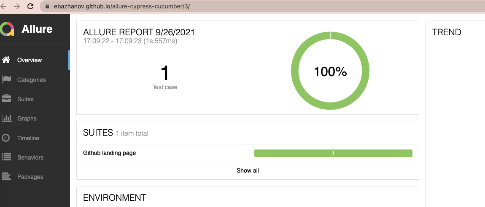

Cypress Allure Plugin Usage Example
----

This repository contains [DEMO](https://ebazhanov.github.io/allure-cypress-cucumber/) 
- how to publish Allure report in `gh-pages`
- more details here [.github/workflows/main.yml](.github/workflows/main.yml)

### How to run locally:

- `$ yarn && yarn cy:run`
- `$ clear previous output yarn allure:clear`
- `$ generate allure report: yarn allure:report`
- `$ open report: allure open`

### Pre-requirements:
- install `Allure` for MacOS e.g. `brew install allure` or `npm install -g allure-commandline --save-dev`

### What happens in github-actions:
- run tests
- restore history of previos run
- create and publish result in gh-pages branch
- [DEMO](https://ebazhanov.github.io/allure-cypress-cucumber/)

### Credits to:

- [@Shelex/cypress-allure-plugin]([https://github.com/Shelex/cypress-allure-plugin])
